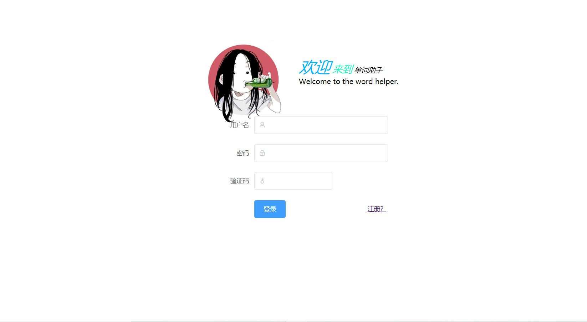
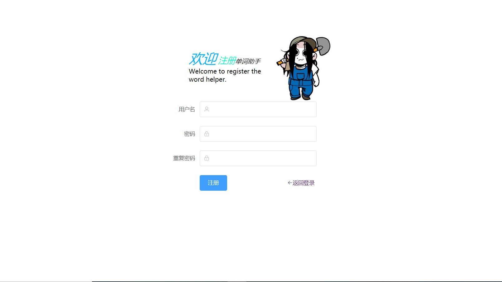
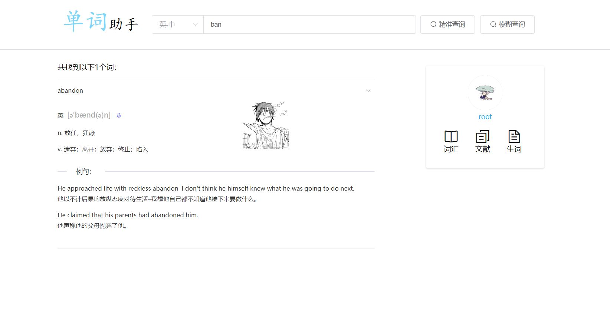
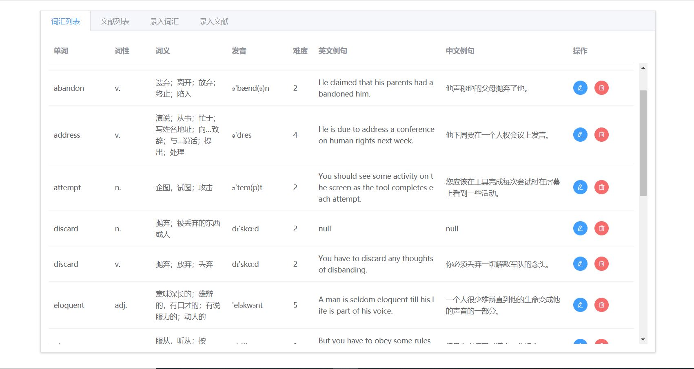
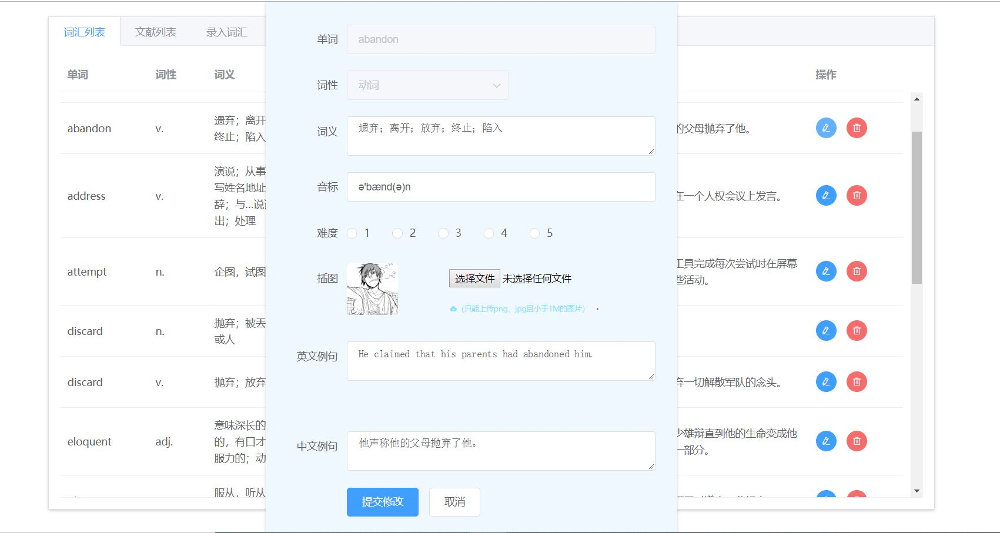

# WordHelper
这是一个学习PHP的时候依照课程设计的要求，做的一个简单的单词助手。

系统通过CDN引入Vue.js和ElementUI，并用PHP搭建了一个十分十分简易的后台。

## 一、设计要求

1、词汇录入与编辑。提供接口让用户录入英文单词、词义、发音、词性（名词/形容词）、难度、例句等。对于已录入的词汇可根据需要进行必要的修改。

2、文献批量载入。提供接口从txt文件（譬如，经典名著）中批量读入英文文献作为范文保存到数据库中。

3、双语查询。支持中英文词汇的精确/模糊查询，即输入英文词汇查询中文意思，或者输入中文词汇查询对应英文意思。为了方便用户写作英文，系统提供例句支持，即从数据库预存的文档中搜索包含特定词汇的英文例句。

4、自定义生词本；

5、词汇测验；

（Vocabulary）词汇表

| **列名**       | **含义** | **数据类型**    | **允许空** | **主键** | **外键** |
| -------------- | -------- | --------------- | ---------- | -------- | -------- |
| **word**       | 单词     | varchar(30)     | NOT NULL   | Yes      | No       |
| **character**  | 词性     | char(5)         | NOT NULL   | Yes      | No       |
| Interpretation | 词义     | Varchar(50)     | NOT NULL   |          |          |
| pronounction   | 音标     | Varchar（20）   | NULL       | No       | No       |
| difficulty     | 难度     | tinyint         | NULL       | No       | No       |
| EngExpl        | 英文例句 | varchar(1000)   | NULL       | No       | No       |
| ChsExpl        | 中文例句 | varchar(500)    | NULL       | No       | No       |
| Picture        | 插图     | varchar（1000） | NULL       |          |          |

6、  对用户录入的数据需进行有效性验证。  

7、  提供注册和登录功能，且对用户密码进行加密保存，登陆时须填写正确的验收码。  

## 二、效果图

------

------

------

------

------

